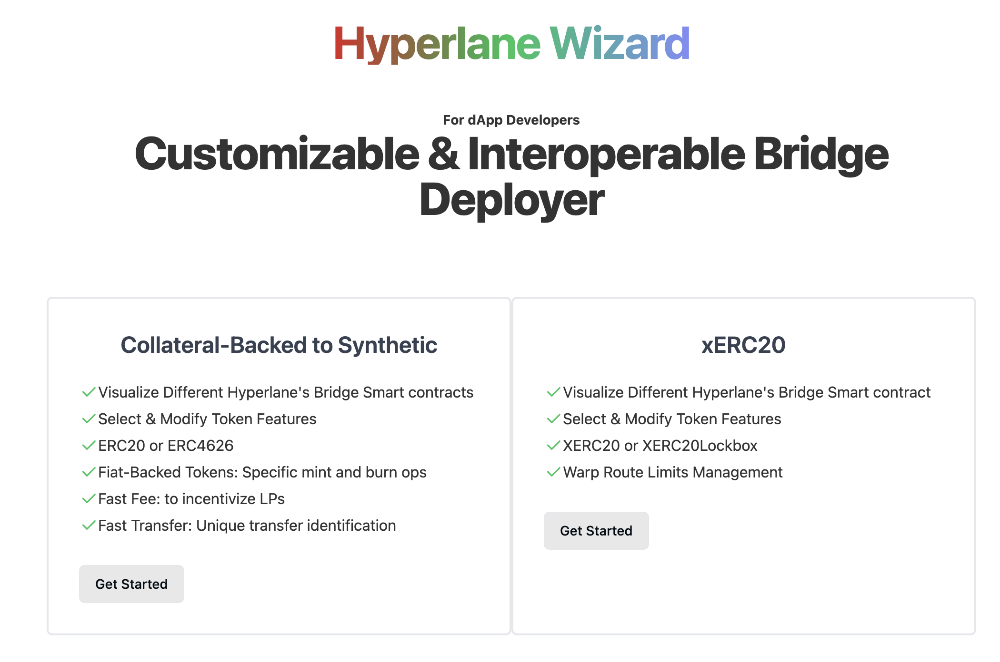

<h1>ETHTaipe Hackathon Project: Hyperlabe Wizard </h1>



- [Installation](#installation)
- [What is it for](#what-is-it-for)


## Installation

Once you've created a project and installed dependencies with `pnpm install` start a development server:

```bash
pnpm dev
```

## Building

To create a production version of your app:

```bash
pnpm run build
```

You can preview the production build with `npm run preview`.

## What Is It For

This dev tool can be thought as a code generator/ interactive playground to support bridge development using Hyperlane's CLI and its smart contact. Now, it offers two routes including collateralized ERC20&`ERC4626 to synthetic` and `XERC20` routes. Specialized features can also be selected. They are , for example, `Fast Fee`, `Fast Transfer` and `Route Limits Management`.

## Acknowledgement

- [OZ 's contracts](https://github.com/OpenZeppelin/openzeppelin-contracts) by **OpenZeppelin**
- [OZ 's Wizard](https://github.com/OpenZeppelin/contracts-wizard/) by **OpenZeppelin**
- [Defi Wonderland's contracts](https://github.com/defi-wonderland/xERC20/blob/main/solidity/contracts)